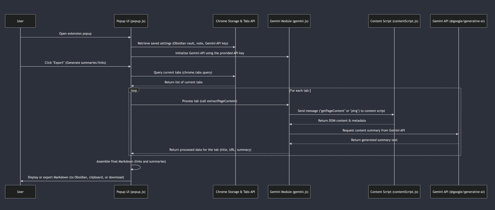

# spareMyMac Chrome Extension

A Chrome extension that helps you save memory on your Mac by collecting URLs from unopened tabs and exporting them to Obsidian notes with AI-generated summaries.

## Features

- Generate AI summaries of tab content using Google's Gemini API
- Export collected URLs with summaries to Obsidian notes
- Copy URLs with summaries to clipboard as markdown
- Download URLs with summaries as a markdown file
- Export links without summaries (faster option)
- Copy links without summaries to clipboard
- Download links without summaries as a markdown file



## Installation

### Prerequisites

- Node.js and npm installed on your computer
- A Google AI (Gemini) API key
- Obsidian with the Advanced URI plugin installed (for Obsidian export functionality)

### Setup

1. Clone or download this repository
2. Navigate to the project folder in your terminal
3. Install dependencies:
   ```
   npm install
   ```
4. Build the extension:
   ```
   npm run build
   ```
5. Load the extension in Chrome:
   - Open Chrome and navigate to `chrome://extensions/`
   - Enable "Developer mode" (toggle in the top right)
   - Click "Load unpacked" and select the `dist` folder

## Obtaining a Gemini API Key

1. Visit [Google AI Studio](https://makersuite.google.com/app/apikey)
2. Sign in with your Google account
3. Create a new API key
4. Copy the API key and paste it in the extension settings

## Obsidian Setup

1. Install Obsidian from [obsidian.md](https://obsidian.md/)
2. Create a vault in Obsidian
3. Install the "Advanced URI" plugin:
   - Go to Settings → Community plugins
   - Turn off "Safe mode" if prompted
   - Click "Browse" and search for "Advanced URI"
   - Install the plugin and enable it

## Usage

1. Click on the spareMyMac icon in your Chrome toolbar
2. Enter your Gemini API key, Obsidian vault name, and note name in Settings
3. Choose one of the following options:

   **With AI Summaries:**
   - "Export to Obsidian" - Exports links and summaries to Obsidian
   - "Copy to Clipboard" - Copies links and summaries as markdown
   - "Download as Markdown" - Downloads the list as a markdown file

   **Links Only (No Summaries):**
   - "Export Links to Obsidian" - Exports only links to Obsidian (faster)
   - "Copy Links to Clipboard" - Copies only links as markdown
   - "Download Links" - Downloads only links as a markdown file

## Obsidian Integration

To export tabs to Obsidian:

1. Enter your Obsidian vault name in the "Obsidian Vault Name" field
2. Enter the note name in the "Note Name" field (the note must already exist in your vault)
3. Click "Export to Obsidian" or "Export Links to Obsidian"

The extension will append the links to your existing note using the Advanced URI plugin. If the note doesn't exist yet, it will be created automatically.

## Development

To build the extension in watch mode during development:
```
npm run watch
```

This will automatically rebuild when files are changed.

## How It Works

The spareMyMac extension is built using several key components that work together to provide its functionality. Here's a detailed explanation of how the code works:

### Architecture Overview

The extension follows a modular architecture with these main components:

1. **Popup Interface** (`popup.html`, `popup.js`): The user interface and main controller
2. **Content Extraction** (`contentScript.js`): Extracts content from web pages
3. **AI Integration** (`gemini.js`): Communicates with Google's Gemini API
4. **Chrome API Integration**: Interacts with browser tabs and storage

### Content Extraction Process

When you use the extension to process tabs, it follows these steps:

1. **Tab Collection**: The extension queries Chrome for all tabs in the current window using `chrome.tabs.query()`.

2. **Content Extraction**: For each tab, the extension:
   - Injects a content script into the tab using Chrome's messaging system
   - The content script analyzes the DOM to find the main content
   - It removes non-content elements like navigation, ads, and footers
   - It prioritizes meaningful content using intelligent selectors
   - The extracted content is sent back to the popup

3. **Fallback Mechanisms**: If direct DOM access fails, the extension has multiple fallbacks:
   - It tries using the Chrome scripting API to inject code directly
   - If that fails, it falls back to basic metadata extraction
   - As a last resort, it attempts to use CORS proxies to fetch content

### AI Summarization

For features that include summaries:

1. **Content Processing**: The extracted content is sent to Google's Gemini API
2. **Prompt Engineering**: A carefully crafted prompt asks for a concise summary
3. **Response Handling**: The API response is processed and formatted as markdown

The extension uses the `gemini-2.0-flash` model, which provides high-quality summaries while balancing speed and accuracy.

### Data Flow

Here's the complete data flow for a typical operation:

1. User clicks a button in the popup interface
2. The popup script collects all tabs from the current window
3. For summarization features:
   - Each tab's content is extracted
   - Content is sent to Gemini API for summarization
   - Summaries are formatted as markdown
4. For links-only features:
   - Tab titles and URLs are formatted directly as markdown links
5. The formatted content is then:
   - Exported to Obsidian using the Advanced URI protocol, or
   - Copied to the clipboard, or
   - Downloaded as a markdown file

### Storage and Settings

The extension uses Chrome's storage API to persist settings:

- **Sync Storage**: Stores the Obsidian vault name, note name, and API key
- **Local Storage**: Temporarily stores processed tab data

### Error Handling

The extension implements robust error handling:

- Content extraction failures trigger fallback methods
- API errors are caught and displayed to the user
- Network issues are handled gracefully with informative messages

### Performance Optimizations

Several optimizations ensure the extension runs smoothly:

1. **Sequential Processing**: Tabs are processed one at a time to prevent overwhelming the browser
2. **Content Filtering**: Only relevant content is extracted and processed
3. **Timeout Handling**: All asynchronous operations have proper timeout handling
4. **Links-Only Option**: Provides a faster alternative when summaries aren't needed

### Security Considerations

The extension follows security best practices:

- API keys are stored securely in Chrome's sync storage
- Content scripts operate in an isolated context
- The extension requests only the permissions it needs
- User data never leaves the browser except for API calls

This architecture makes the extension both powerful and flexible, allowing it to handle a wide variety of web pages while providing useful summaries and organization options.

## Notes

- You need to have Obsidian installed with the Advanced URI plugin for the Obsidian export feature to work
- The extension appends to existing notes rather than creating new ones
- The extension uses a CORS proxy to fetch page content from different origins
- For faster operation without AI summaries, use the "Links Only" options

## License

MIT 